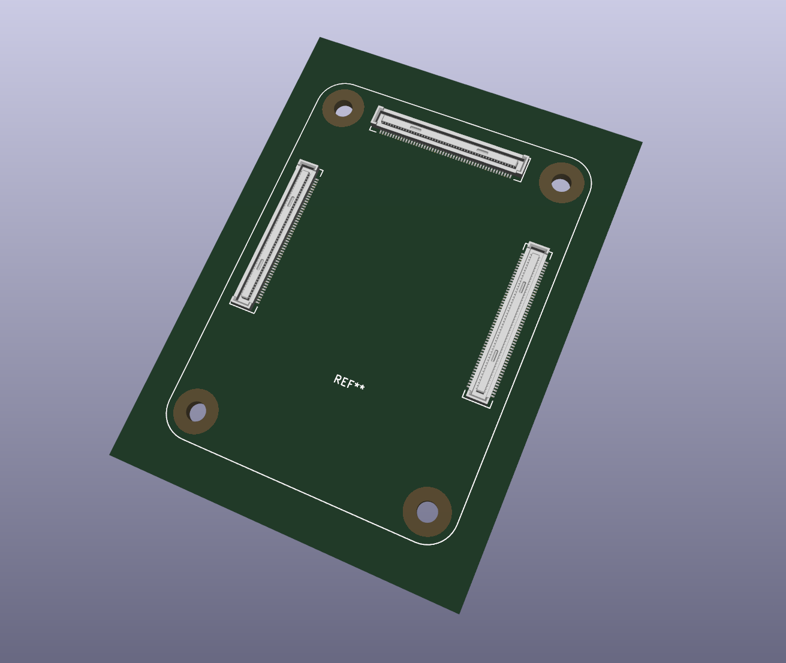
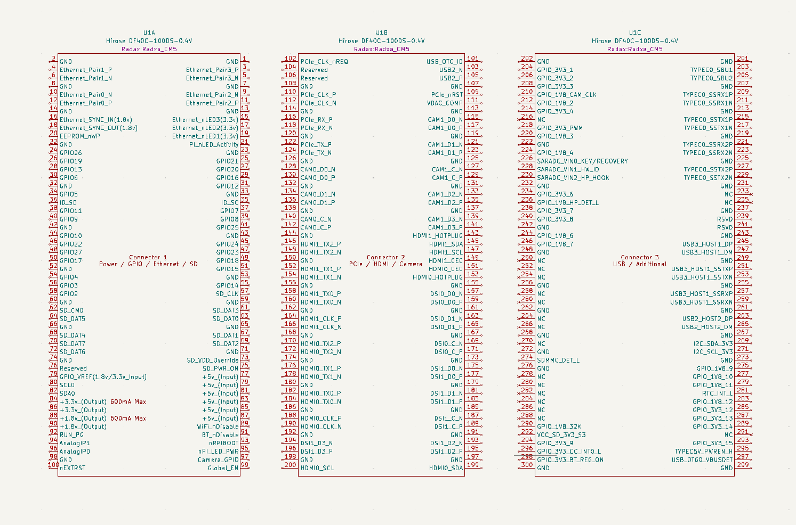
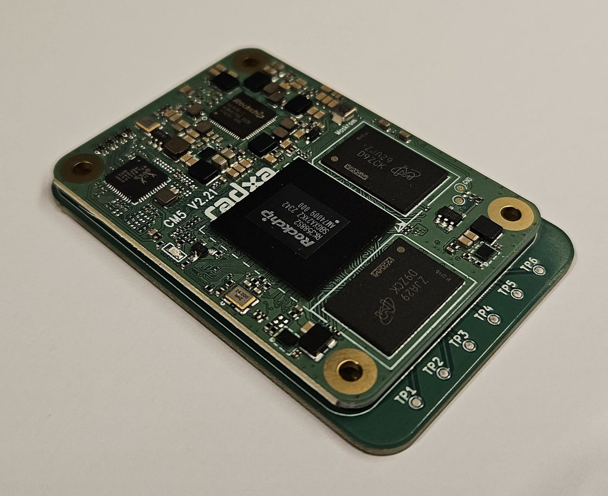

# Radxa CM5 KiCAD Library

This repository contains a [KiCAD](https://www.kicad.org/) Symbol, Footprint,
and 3D model for the [Radxa CM5](https://radxa.com/products/cm/cm5) compute module.

## Symbol Units

The KiCAD symbol consists of three units which map to the [CM5 Schematic](https://dl.radxa.com/cm5/v2210/radxa_cm5_v2210_schematic.pdf) as follows:

- Unit-A is schematic reference U13-A
- Unit-B is schematic reference U13-B
- Unit-C is schematic reference J1

Note:  Due to the limitation of how KiCAD maps pin numbers between Symbol and Footprint, Unit-C is numbered from 201 to 300.  To match schematic reference J1's pinout subtract 200, eg:   Unit-C Pin 217 is J1's Pin 17.

## Mechanical Validation

The footprint has been mechanically validated for correct fit with CM5 module.

## SMD Stencil

Order SMD stencil with 0.10mm thickness.

## CM4 Compute Module

KiCAD files for CM4 also [available here](https://github.com/swdee/radxa-cm4-kicad).

## References

* [Hirose DF40C-100DS-0.4V(51) connector](https://www.hirose.com/en/product/p/CL0684-4033-4-51)
* [Radxa CM5 Schematic](https://dl.radxa.com/cm5/v2210/radxa_cm5_v2210_schematic.pdf) - Page 4
* [Radxa CM5 IO Board Schematic](https://dl.radxa.com/cm5/v2200/radxa_cm5_io_v2200_schematic.pdf) - Page 17
